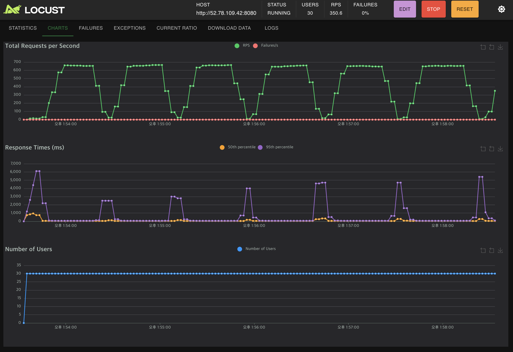

<a name="readme-top"></a>

<!-- PROJECT LOGO -->
<br />
<div align="center">
  <a href="https://github.com/YEASEUL-JANG/onion-market">
    
  </a>

  <h3 align="center">🧅 Onion Market 🧅</h3>

  <p align="center">
    백엔드 프로젝트 - 대규모 트래픽 처리와 안정적인 서비스 운영을 목표로 설계된 중고 마켓 게시판 API
  </p>
</div>

<!-- TABLE OF CONTENTS -->
<details>
  <summary>Table of Contents</summary>
  <ol>
    <li>
      <a href="#1-프로젝트-개요">1. 프로젝트 개요</a>
    </li>
    <li>
      <a href="#2-프로젝트-목적">2. 프로젝트 목적</a>
    </li>
    <li>
      <a href="#3-사용-기술-및-라이브러리">3. 사용 기술 및 라이브러리</a>
    </li>
    <li>
      <a href="#4-기술설명">4. 기술설명</a>
    </li>
    <li>
      <a href="#5-source">5. Source</a>
    </li>
    <li>
      <a href="#6-알게된-점">6. 알게된 점</a>
    </li>
  </ol>
</details>
<br />

## 1. 프로젝트 개요

Onion Market은 대규모 트래픽을 처리하는 중고 마켓 게시판을 모티브로 설계된 백엔드 프로젝트입니다.  
사용자 수 증가에 따른 서버 성능 문제를 해결하고, 안정적인 서비스 운영을 목표로 다양한 기술 스택을 적용하여 개발되었습니다.  
본 프로젝트는 프론트엔드 화면 없이 API 테스트를 통해 진행되었으며, 실제 서비스 환경에서 발생할 수 있는 다양한 시나리오를 경험하고 해결하는 데 중점을 두었습니다.

## 2. 프로젝트 목적

- **대규모 트래픽 처리 경험**: 사용자 수와 동시 접속자 수 증가에 따른 서버 성능 변화를 직접 경험하고, 적절한 데이터베이스 및 메시지 큐 시스템을 도입하여 확장성 확보  
- **성능 최적화 및 안정성 확보**: 다양한 성능 개선 기법(캐싱, 인덱싱, 비동기 처리 등)을 적용하여 시스템 응답 시간을 단축하고, 안정적인 서비스 운영을 위한 기반 마련  
- **분산 시스템 구축 및 운영**: 메시지 큐 시스템(RabbitMQ, Kafka)을 활용하여 비동기 처리를 구현하고, 서버 부하 분산 및 대량 알림 전송 기능 개발  
- **데이터 분석 및 모니터링**: Elasticsearch, Kibana, MongoDB를 활용하여 실시간 데이터 분석 및 시각화 환경을 구축하고, 시스템 운영 효율성 향상

## 3. 사용 기술 및 라이브러리

- **Languages**: Java 11, SQL  
- **Backend**: Spring Boot, Spring Data JPA, Querydsl, Spring Security, JWT, Spring Batch  
- **Database**: MySQL, MongoDB  
- **Search**: Elasticsearch, Kibana  
- **Cache**: Redis  
- **Message Queue**: RabbitMQ  
- **DevOps**: Docker, Jenkins, Locust, Logstash  
- **Tools**: IntelliJ, MySQL Workbench, Git, GitHub

## 4. 기술설명

### 1단계: 기본 게시판 기능 개발

- **설명**: MySQL을 활용해 글과 댓글을 포함한 게시판의 CRUD 기능을 개발하고, JWT 기반의 인증 및 로그아웃 기능을 추가하였습니다.

  
    
- **구현포인트**
  - 데이터 수정, 생성, 삭제 시 중복처리 방지 및 문제가 발생 시 롤백(@Transaction 처리)
  - AOP를 활용하여 중앙에서 에러 처리를 관리
  - 데이터베이스 인덱스 추가를 통한 조회 성능 최적화  
  - [🔗 다른 기기 로그아웃을 위한 Blacklist 적용](https://ysdlog.notion.site/JWT-a10e578c4663461fa588267fdc64fe30?pvs=4)

### 2단계: 게시글 검색 성능 개선

- **설명**: 대량 데이터와 다양한 검색 조건에 따른 DB 부하를 해결하기 위해 Elasticsearch를 도입하여 검색 속도를 약 7배 개선하였습니다.

  

- **구현포인트**:
  - SQL 조회 대비 Elasticsearch의 빠른 검색 성능 확인  
  - SQL 조회 vs Elasticsearch 조회 성능 테스트  
    - 게시글 테이블에 임의 데이터 10만 건 셋팅  
    - 아래 SQL 쿼리로 조회:
    
      ```sql
      @Query("SELECT a FROM Article a WHERE a.board.id = :boardId AND a.isDeleted = false AND (a.title LIKE %:keyword% OR a.content LIKE %:keyword%)")
      List<Article> findByKeywordWithSql(@Param("boardId") Long boardId, @Param("keyword") String keyword);
      ```
      
    - Elasticsearch를 통한 조회 예시:
    
      ```java
      Mono<String> elasticArticleIds = elasticsearchService.searchArticleIdsByKeyword(keyword);
      List<Long> articleIds = elasticArticleIds
          .map(this::extractIdsFromElasticsearchResponse)
          .block();
      List<Article> articles = articleRepository.findAllById(articleIds);
      ```
      
    - 테스트 결과, Elasticsearch 도입으로 약 7배 빠른 조회 성능을 확인  
  - Kibana를 통한 인기 게시글 대시보드 구축

### 3단계: 광고 배너 기능 개발 및 캐싱

- **설명**: 광고 배너 데이터 잦은 조회로 인한 DB 부하를 줄이기 위해 Redis 캐싱을 도입하여 빠른 조회를 가능하게 하였습니다.

  

- **구현포인트**:
  1. 광고 등록 시 redis와 mysql에 함께 저장(데이터 일관성 유지)
  2. 광고 조회 시 우선 redis 캐시를 사용, 없으면 mysql 조회  
  3. 동시 접속자 급증에도 안정적인 응답시간 유지

### 4단계: 광고 조회/클릭 집계 및 MongoDB 도입

- **설명**: 광고 클릭 데이터를 MongoDB에 기록하고, Spring Batch로 매일 자정 MySQL에 집계 데이터를 저장하여 효율적인 데이터 분석 환경을 구축하였습니다.

  

- **구현포인트**:
  - MongoDB로 광고 클릭 로그 기록 후 배치 집계  
  - Logstash를 통한 Elasticsearch 동기화 및 Kibana 대시보드 구축
    

### 5단계: 서버 부하 분산 및 대량 알림 전송

- **설명**: RabbitMQ와 Kafka를 도입하여 서버 접속자 증가 및 대량 알림 처리를 비동기로 처리하고 유연한 확장성을 확보하였습니다.

  

- **구현 포인트**:
  - RabbitMQ를 통한 대량 알림 지연 발송 및 자동 재시도  
  - Kafka를 통한 실시간 스트림 데이터 처리

---

## Locust 를 활용한 부하테스트 및 성능 개선결과 정리

[📜 Project_onion market_ 성능개선 결과테스트](https://ysdlog.notion.site/Project_onion-market_-158c8bc8fd3980828a4cd8c2fea5f7ad?pvs=4)

### 주요 성과

1. **병목 개선 전후 비교**
    - 광고 노출: 평균 응답시간 **198.03ms → 62.96ms** (약 68.2% 개선), P99 **742ms → 192ms** (약 74% 개선)
    - 광고 클릭: 평균 응답시간 **618.34ms → 79.49ms** (약 87.1% 개선), P99 **2820ms → 246ms** (약 91% 개선)
2. **게시글 상세 조회**: 평균 응답시간 **1450ms → 401ms** (약 72% 개선), P99 **3622.94ms → 888.94ms** (약 75% 개선)
3. **게시글 작성**: 평균 응답시간 **757.04ms → 440.95ms** (약 42% 개선), 처리량 RPS **0.66 → 1.3** (약 2배 증가)

### 최대 동시 접속자 수

- **100명**: 대부분의 API 평균 응답시간 1초 이내, 안정적 RPS 및 0% 실패율  
- **150명**: 일부 API에서 응답시간 1초 초과, 성능 저하 시작  
- **200명**: 주요 API 평균 응답시간 1초 이상, 시스템 부하 한계 확인

### 결론

- **최대 안정 동시 접속자 수**: 100명  
- API 응답시간 최대 87.1% 개선  
- 향후 추가 확장을 위해 서버 스케일링 및 DB 최적화 지속 필요

---

## 5. Source

[GitHub - YEASEUL-JANG/onion-market](https://github.com/YEASEUL-JANG/onion-market.git)

---

## 6. 알게된 점

- **캐싱 전략의 중요성**: Redis 캐싱 도입으로 광고 조회 성능이 크게 향상됨  
- **검색 엔진 활용**: Elasticsearch와 Kibana를 통한 검색 및 시각화 경험  
- **메시지 큐 시스템**: RabbitMQ를 통한 비동기 처리로 대량 작업 효율 증대  
- **부하테스트 및 성능개선**: Locust 부하 테스트를 통한 병목 구간 파악 및 대응  
- **DB 최적화**: 인덱스 추가와 쿼리 튜닝을 통한 전반적인 성능 개선

<p align="right">(<a href="#readme-top">back to top</a>)</p>
